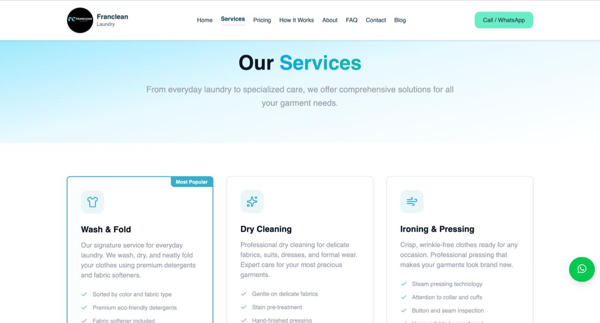
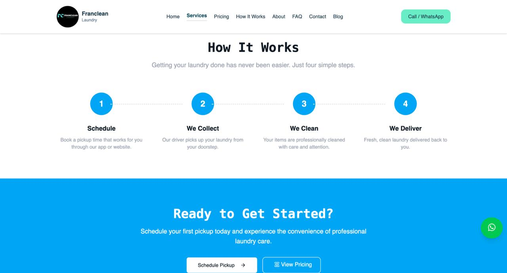

# Franclean Laundry Website 🧺✨

Franclean Laundry is a modern laundry service website that allows customers to view services, pricing, and request a quote or schedule a pickup online.

This project is built to be fast, mobile-friendly, and easy to maintain.

---

##Services Page

## 🚀 Features

- Modern responsive UI (mobile + desktop)
- Service pages (Wash & Fold, Dry Cleaning, Ironing, etc.)
- Get a Quote form (customer submits details online)
- Pickup scheduling (optional)
- Customer-friendly pricing display
- Supabase integration (form submissions + storage)

---

## 🛠️ Tech Stack

- **Next.js** (React)
- **Tailwind CSS**
- **Supabase** (Database + API)
- **SweetAlert2** (Alerts / notifications)

---

## how it works section

